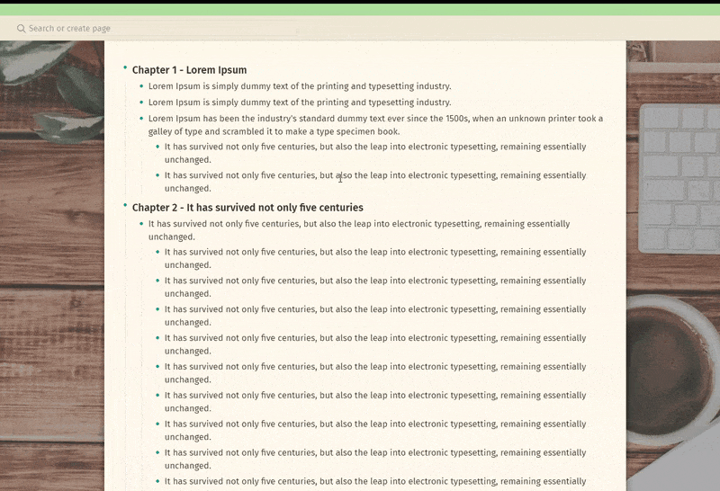
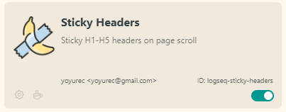

<h1 align="center">"Sticky headers" plugin for Logseq</h1>

    

`H1-H5` headers in page will "stick" to top on page scroll, helping you not to loose reading section name.

⚠ Position calculations are tricky, so reloading Logseq _(Ctrl/Cmd + R)_ sometimes needed after installing/uninstalling plugins or switching themes! ⚠

## If you ❤ what i'm doing - you can support my work! ☕

## Install theme
From Logseq store - `Plugins -> Marketplace`.

## Recommended plugins
* 🐱‍👤 [Solarized Extended](https://github.com/yoyurec/logseq-solarized-extended-theme) theme
* ⭐ [Awesome Links](https://github.com/yoyurec/logseq-awesome-links)

## What is Logseq?
Logseq is a privacy-first, open-source knowledge base. Visit https://logseq.com for more information.

## Support
* Read about Logseq plugin updates on Dicscord - https://discord.com/channels/725182569297215569/896368413243494430
* Ask about Logseq plugins on Dicscord - https://discord.com/channels/725182569297215569/752845167030960141
* If you have any questions, issues or feature request, use the issue submission on GitHub: https://github.com/yoyurec/logseq-sticky-headers/issues

## Credits
* Icon - https://www.flaticon.com/free-icon/banana_3369612

## License
[MIT License](./LICENSE)
